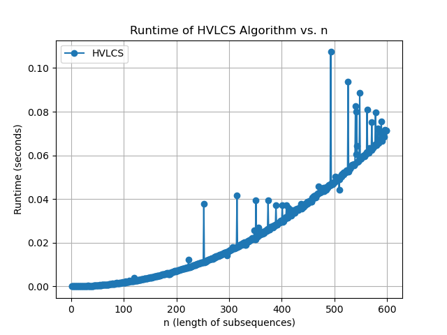

# Highest Value Longest Common Sequence

Ryan Froug (83197825) | Yoan Exposito (24603154)

## Programming Assignment 3

<u>All instructions will be with respect to the root directory of the repo</u>

Example input and output files are in the `data/` directory (e.g., `data/test1.in` and `data/test1.out`).

To set up the repo:

- `python3 -m venv .venv`
- `source .venv/bin/activate`
- `pip install -r requirements.txt`

To run the program with an input file:

```
python src/main.py data/test1.in
```

To run all tests:

```
python tests/test_hvlcs.py
```

To run graph:

```
python src/graph.py
```

## Note for macOS users

If `python` is not found, try `python3`. Starting with macOS Monterey 12.3, Apple removed the pre-installed Python 2.7 and the `python` command may not be linked to `python3` automatically.

## Input Format

```
K
x1 v1
x2 v2
...
xK vK
A
B
```

- `K` is the number of characters in the alphabet
- Each of the next `K` lines is a character and its nonnegative integer value
- `A` and `B` are the two strings

## Output Format

```
9
cb
```

Line 1: maximum value of a common subsequence of A and B  
Line 2: one optimal common subsequence achieving that value

## Example

Input (`data/test1.in`):
```
3
a 2
b 4
c 5
aacb
caab
```

Output (`data/test1.out`):
```
9
cb
```

---

## Question 1: Empirical Comparison



## Question 2: Recurrence Equation

**Equation**

```
OPT[i][j]= {
    0, for i=0 and/or j=0
    max(OPT[i-1][j], OPT[i][j-1]), for A[i] != B[j]
    v(A[i]) + OPT[i-1][j-1], for A[i] = B[j]
    }
```
**Why This is Correct**

`OPT[i][j]` represents the maximum value achievable from a common subsequence of `A[1..i]` and `B[1..j]`. When either string is empty (i=0 or j=0), there are no characters to match, so the only common subsequence is the empty one with value 0. Case 1 — A[i] != B[j]: These two characters cannot both be the last character of any common subsequence. The optimal solution must come from either ignoring `A[i]` (solving for `A[1..i-1]` and `B[1..j]`) or ignoring `B[j]` (solving for `A[1..i]` and `B[1..j-1]`). We take the max of the two. Case 2 — A[i] == B[j]:** The characters match, so we always include them. Since all values are nonnegative, including a matching character never decreases the total value, making it always at least as good as skipping it. We take `v(A[i])` and add it to the best solution for the remaining prefixes `A[1..i-1]` and `B[1..j-1]`. These two cases are exhaustive — every pair (i, j) either matches or it doesn't. Each subproblem depends only on strictly smaller indices, so the recursion terminates and the full table can be filled bottom-up.

---

## Question 3: Big-Oh

**Pseudocode:**

```
HVLCS(A, B, v):
    n = len(A), m = len(B)
    initialize OPT[0..n][0..m] = 0

    for i = 1 to n:
        for j = 1 to m:
            if A[i] == B[j]:
                OPT[i][j] = v[A[i]] + OPT[i-1][j-1]
            else:
                OPT[i][j] = max(OPT[i-1][j], OPT[i][j-1])

    // Traceback to reconstruct the subsequence
    S = ""
    i = n, j = m
    while i > 0 and j > 0:
        if A[i] == B[j]:
            S = A[i] + S
            i -= 1, j -= 1
        else if OPT[i-1][j] >= OPT[i][j-1]:
            i -= 1
        else:
            j -= 1

    return OPT[n][m], S
```

**Runtime: O(n × m)**

Filling the DP table visits every cell of an (n+1) × (m+1) matrix, each in O(1) time — giving O(n·m). The traceback walks at most n+m steps, which is O(n+m). The dominant term is **O(n·m)**, or **O(n²)** when both strings have equal length n.
